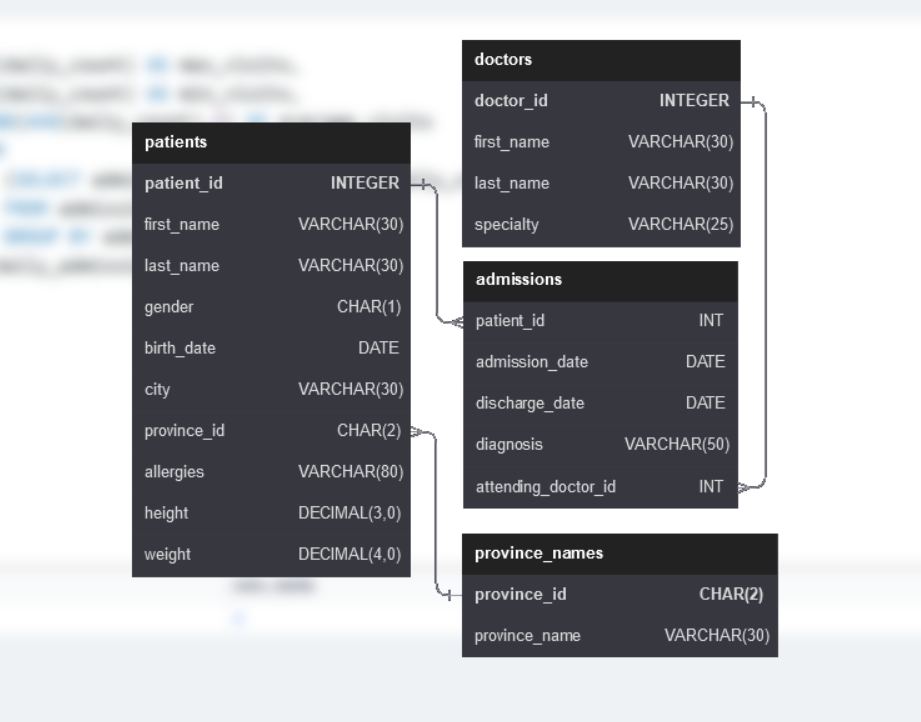

# Hospital Database - 70 SQL Queries

## About the Project
This is my **first SQL project**!  

I solved all **70 practice questions** from [sql-practice.com](https://www.sql-practice.com/) using the **Hospital database**.  

It helped me learn real SQL skills like JOINs, GROUP BY and more — all through hospital data (patients, admissions, doctors, billing, etc.).

## Files in this Repository
- `hospital_70_queries.sql` ← All 70 questions + my solutions (main file)
- `schema.png` ← Database schema diagram
- `README.md` ← This file

## Database Schema

**Note**: You can download the Hospital database from sql-practice.com if you want to run it yourself.

## Author
**Kabir Kharadi**  
First SQL Project | Learning Data Analysis  

---